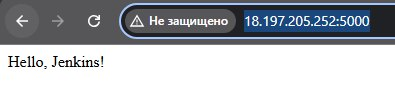
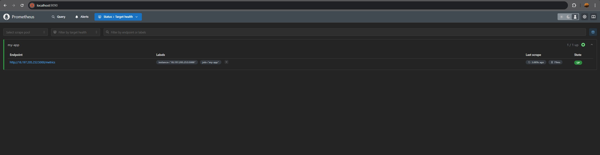
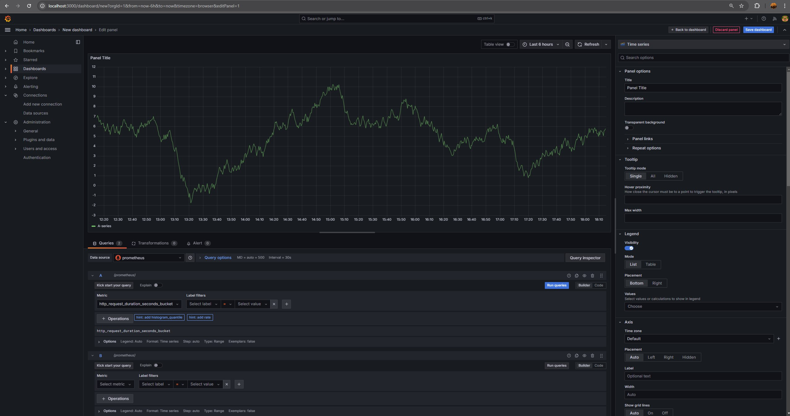
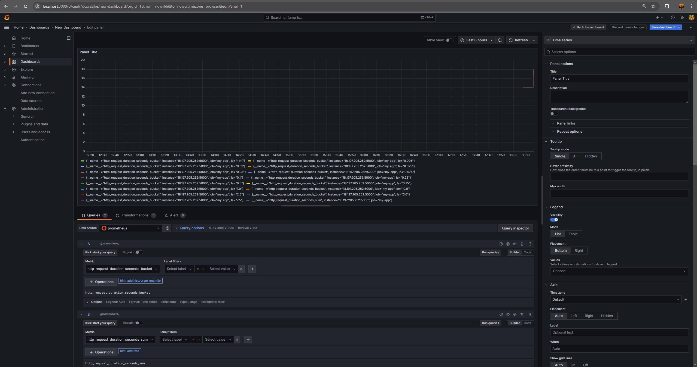

# panda-test
Test tasks for Panda.

Для розортання застосунку використовується Jenkins та Docker. Вони розгорнуті на ВМ в AWS.
Після написання Terraform-коду, вона була розгорнута з вхідними правилами фаєрволу.
Цей застосунок також у подальшому буде розгорнутий в контейнері на цій ВМ.
В фалі Jenkins описані етапи пайплайну:
1) Створення двох тестових контейнерів, перший з застосунком, другий з тестовою програмою для нього.
2) Запуск Docker-compose.
3) Тестування застосунку.
4) Видалення тестового стенду та запуск контейнеру з застосунком.

Для моніторингу роботи додатку треба виконати розгортання, яке описане в директорії /fot_monitoring.
Створюється два контейнеру з Grafana та Prometheus. 

Після їх запуску треба в веб-інтерфейсі Grafana прописати url для Prometheus.

В резульаті отримаємо дашборд зі статистикою запитів. 

